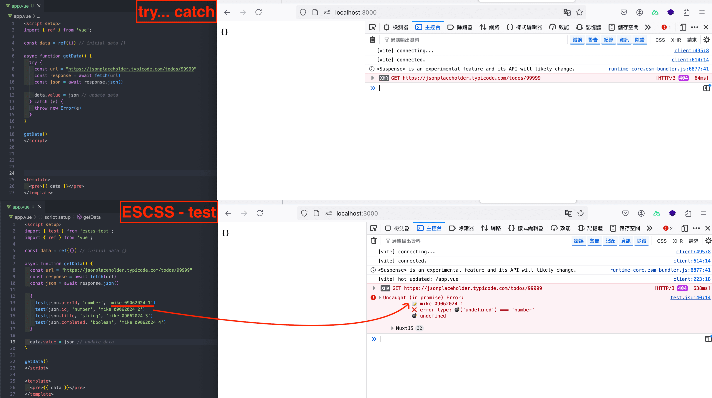
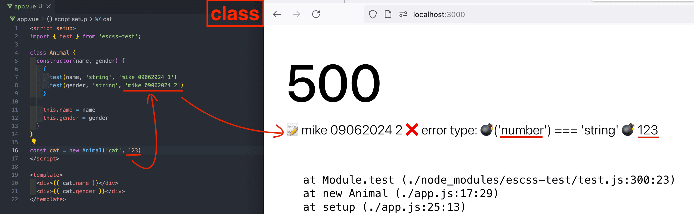

# What is ESCSS-test?

Inspired by TDD and TypeScript, it helps you achieve 100% function coverage.

## Core Concept - Water Filter

```js
function foo() {
  {
    // unhappy path(throw error here, under {} to be organized)
  }

  // happy path
}
```

## Requirements

vite >= 4.4.0

## Demo

- pure vs impure function
  

- async/await & try-catch
  

- class
  

- Get report
  - The order of steps 1-3 is a concern regarding async/await.
  1. start your dev server
  2. use getReport() under root component
  3. hit save for hot reload(Vite)
  4. get a console.log report in browser

## Usage

```js
// Type mode
test(1, "number");
test(1n, "bigint");
test("foo", "string");
test(true, "boolean");
test([], "array"); // new type
test({}, "object");
test(NaN, "NaN"); // new type
test(null, "null"); // new type
test(undefined, "undefined"); // new type
test(Symbol(), "symbol");
test(function () {}, "function");
test(1, "object"); // error
test(1, "object", "mike 09062024 001"); // The error message should provide a unique ID for troubleshooting

// Operator mode
test(1, "<", 5);
test(5, ">", 1);
test(1, "<=", 5);
test(5, ">=", 1);
test(1, "!==", 2);
test(1, "===", 1);
test(1, "===", 100); // error
test(1, "===", 100, "mike 09062024 001"); // The error message should provide a unique ID for troubleshooting

// Get console.log report (Ｕse it in the root component)
getReport();
```

## Q&A

### Will ESCSS-test become obsolete?

ESCSS-test is based on the 'null' type, which has been a legacy bug for decades. I don't believe this library will become obsolete. The core is complete, so significant changes are unlikely in the future.

## Installation

```shell
  npm install escss-test
  yarn add escss-test
  bun add escss-test
```

## Run Test Cases

1. clone project
2. bun install
3. bun test

## License

Dual Licensing（Commercial or AGPL 3.0）,see [LICENSE](./LICENSE)
