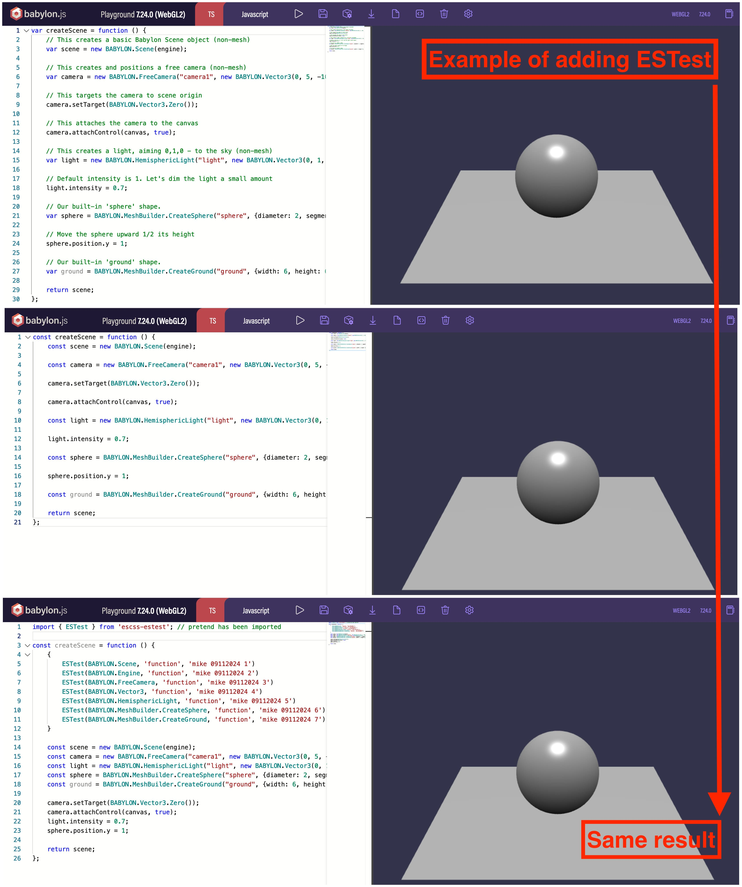

# What is ESCSS-ESTest?

ESCSS-ESTest helps you to achieve 100% function coverage by taking the potential of TDD and TypeScript.

## Core Concept - Water Filter

```js
function foo() {
  {
    // unhappy path(filter to throw error)
  }

  // happy path(the result that you are expected)
}
```

## Requirements

Vite >= 4.4.0 (if you use it)

## Demo

### OOP Scenario


### Pure vs Impure function

```js
import { ESTest } from 'escss-estest';

let isEnable = true

// impure function
function getSum(a, b) {
  if(!isEnable) return 0

  return a + b
}

// pure function
function getSum2(a, b) {
  {
    ESTest(a, 'number', 'mike 09102024 1')
    ESTest(b, 'number', 'mike 09102024 2')
    ESTest(isEnable, 'boolean', 'mike 09102024 3')
  }

  if(!isEnable) return 0

  return a + b
}
```

### Error handling: async/await
```js
import { ESTest } from 'escss-estest';

async function getData() {
  const url = "https://jsonplaceholder.typicode.com/todos/99999" // undefined api
  const response = await fetch(url)
  const json = await response.json()

  {
    ESTest(json.userId, 'number', 'mike 09102024 1')
    ESTest(json.id, 'number', 'mike 09102024 2')
    ESTest(json.title, 'string', 'mike 09102024 3')
    ESTest(json.completed, 'boolean', 'mike 09102024 4')
  }

  console.log(json)
}

getData() // get error
```

### Error handling: class

```js
import { ESTest } from 'escss-estest';

class Animal {
  constructor(name, gender) {
    {
      ESTest(name, 'string', 'mike 09102024 1')
      ESTest(gender, 'string', 'mike 09102024 2')
    }

    this.name = name
    this.gender = gender
  }
}

new Animal('cat', 123) // get error
```

### Get report

1. start your dev server
2. use getReport() under root component
3. hit save for hot reload(Vite)
4. get a console.log report in browser

**_The order of steps 1-3 is a concern regarding async/await. For reference only, complete protection your codebase requires E2E_**

## Usage

```js
// Type mode
ESTest(1, "number");
ESTest(1n, "bigint");
ESTest("foo", "string");
ESTest(true, "boolean");
ESTest([], "array"); // new type
ESTest({}, "object");
ESTest(NaN, "NaN"); // new type
ESTest(null, "null"); // new type
ESTest(undefined, "undefined"); // new type
ESTest(Symbol(), "symbol");
ESTest(function () {}, "function");
ESTest(1, "object"); // error
ESTest(1, "object", "mike 09062024 001"); // The error message should provide a unique ID for troubleshooting

// Operator mode
ESTest(1, "<", 5);
ESTest(5, ">", 1);
ESTest(1, "<=", 5);
ESTest(5, ">=", 1);
ESTest(1, "!==", 2);
ESTest(1, "===", 1);
ESTest(1, "===", 100); // error
ESTest(1, "===", 100, "mike 09062024 001"); // The error message should provide a unique ID for troubleshooting

// Get console.log report (Ｕse it in the root component)
getReport();
```

## Q&A
### Why did your versioning start at v1.2.x?

I initially started at v1.0.0 and experimented quite a bit, which led to some inconsistencies. That's why the official versioning begins at v1.2.x.

## Installation

```bash
### npm
  npm install escss-estest

### yarn
  yarn add escss-estest

### bun
  bun add escss-estest
```

## Run Test Cases

1. clone project
2. bun test (I have installed bun globally)

## License

Dual Licensing（Commercial or AGPL 3.0）,see [LICENSE](./LICENSE)
